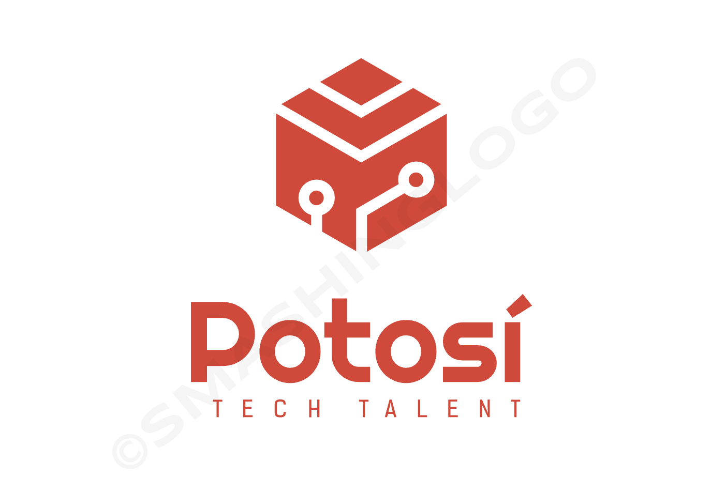

<a name="readme-top"></a>

<div align="center">
  

</div>


# 📗 Index

- [📖 About the Project](#about-project)
  - [🛠 Built With](#built-with)
    - [Key Features](#key-features)
  <!-- - [🚀 Live Demo](#live-demo) -->
- [💻 Getting Started](#getting-started)
  - [Setup](#setup)
  - [Prerequisites](#prerequisites)
  - [Testing](#testing)
  - [Usage](#usage)
  - [Deployment](#deployment)
- [👥 Authors](#author)
- [🔭 Future Features](#features)
- [🤝 Contributing](#contributing)
- [⭐️ Show your support](#support)
- [🙏 Acknowledgements](#acknowledgements)
- [📝 License](#license)

<!-- PROJECT DESCRIPTION -->

# 📖 Potosi Tech Talent Blog `[Ruby On Rails]` <a name="about-project"></a>

Welcome to the Potosi Tech Talent Blog Page Ruby on Rails app repository! This app powers the platform where tech enthusiasts can write and share insightful blog posts on various tech-related topics. Whether you're a seasoned developer or a curious learner, this app provides a space to engage with the community and contribute to meaningful discussions.

## 🛠 Built With <a name="built-with"></a>

### Tech Stack <a name="tech-stack"></a>

<details>
    <summary>Client</summary>
    <ul>
      <li><a href="https://www.ruby-lang.org/en/">Ruby</a></li>
      <li><a href="https://rubyonrails.org/">Ruby on Rails</a></li>
    </ul>
  </details>

<details>
<summary>Database</summary>
  <ul>
   <li><a href="https://www.postgresql.org/">PostgreSQL</a></li>
  </ul>
</details>

<!-- Features -->

### Key Features <a name="key-features"></a>

- **[MVC Pattern]** Follows the MVC(Model, View, Controller) pattern which allows it to be easy to manage
- **[Authentication]** Counts with an authentication system using [Devise Gem](https://github.com/heartcombo/devise) which allows the user to have an unique account with its own email and password, and also allows the user to edit its own profile
- **[Migration of Database using Rails method]** All the data storaged is actually being managed by a Database, and the migration of the database is being done using the rails method
- **[Testing]** All the views are being tested using [RSpec](https://rspec.info/) and [Capybara](https://github.com/teamcapybara/capybara)
- **[Linters]** It follows the rules of 2 very well knowed linters [Rubocop](https://rubocop.org/) & [Stylelint](https://stylelint.io/), which helps to keep the code clean and easy to read
- **[Gitflow]** Used [Gitflow](https://www.atlassian.com/git/tutorials/comparing-workflows/gitflow-workflow) as a workflow which allows to have a clean and organized version control

<p align="right">(<a href="#readme-top">back to top</a>)</p>

<!-- LIVE DEMO -->

<!-- ## 🚀 Preview <a name="live-demo"></a>

Will be implemented in the future -->

<p align="right">(<a href="#readme-top">back to top</a>)</p>

<!-- GETTING STARTED -->

## 💻 Getting Started <a name="getting-started"></a>

To get a local copy up and running, follow these steps.

### Prerequisites

In order to run this project you need:

```sh
 To have ruby installed with the last version of rails
```

### Setup

Clone this repository to your desired folder:

```sh
  Run bundle install to install all the gems and dependencies
```

### Usage

To run the project, execute the following command:

```sh
  Executing the command 'rails server' will start the server of this RoR app
```

### Testing

To run integration tests, you have to follow these steps:

```sh
  Executing the command `bundle install` will install all the necessary dependencies to run the tests of this RoR app
```

```sh
  To run all the tests, execute the command 'rspec'
```
<!-- 
```sh
  To run specific the specific tests for each view, execute one of the following codes:

  Do user_index view test command: 'rspec spec/views/users/index.html.erb_spec.rb'
  Do user_show view test command: 'rspec spec/views/users/show.html.erb_spec.rb'
  Do posts_index view test command: 'rspec spec/views/posts/index.html.erb_spec.rb'
  Do posts_show view test command: 'rspec spec/views/posts/show.html.erb_spec.rb'
``` -->

### Deployment

No deployment necessary

<p align="right">(<a href="#readme-top">back to top</a>)</p>

<!-- AUTHOR -->

## 👥 Author <a name="author"></a>

👤 **Álvaro Iporre Martínez**

- GitHub: [@alvaroiporre](https://github.com/alvaroiporre)
- Twitter: [@alvaro.iporre](https://twitter.com/Alvaro41065582)
- LinkedIn: [Álvaro Iporre](https://www.linkedin.com/in/alvaroiporre/)

<!-- ## ✨ Contributors
 -->


<!-- FEATURES -->

## 🔭 Future Features <a name="features"></a>

- **[Responsive Design]** Build a fully responsive design
- **[Live Demo]** Deploy the app in a live server
- **[User Profile]** Add a user profile page

<p align="right">(<a href="#readme-top">back to top</a>)</p>

<!-- CONTRIBUTING -->

## 🤝 Contributing <a name="contributing"></a>

Contributions, issues, and feature requests are welcome!

Feel free to check the [issues page](https://github.com/alvaroiporre/Tech-Talent-Potosi/issues).

<p align="right">(<a href="#readme-top">back to top</a>)</p>

<!-- SUPPORT -->

## ⭐️ Show your support <a name="support"></a>

If you like this project, be pending on my profile since I'll be doing much more!

<p align="right">(<a href="#readme-top">back to top</a>)</p>

<!-- ACKNOWLEDGEMENTS -->

## 🙏 Acknowledgments <a name="acknowledgements"></a>

I would like to thanks my Microverse Team and partners for helping me to get this done.

<p align="right">(<a href="#readme-top">back to top</a>)</p>

<!-- LICENSE -->

## 📝 License <a name="license"></a>

This project is [MIT](./LICENSE) licensed.

<p align="right">(<a href="#readme-top">back to top</a>)</p>